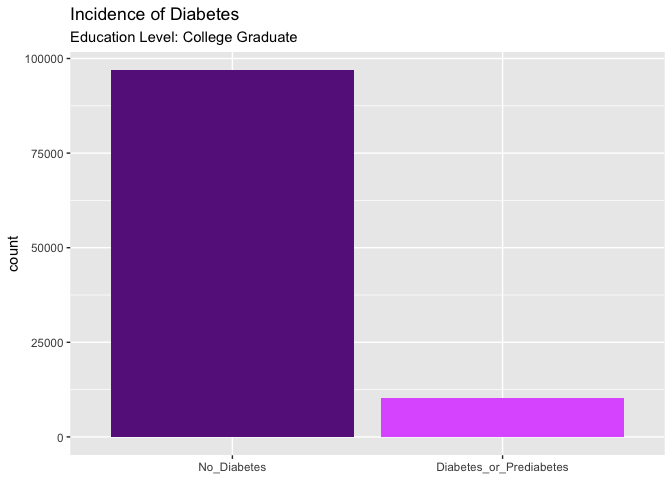
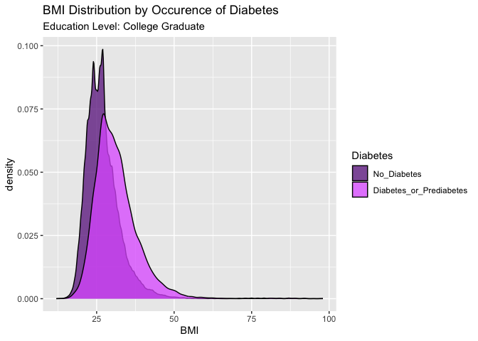
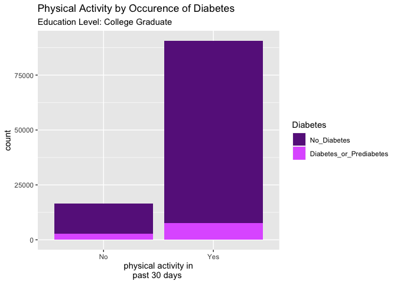
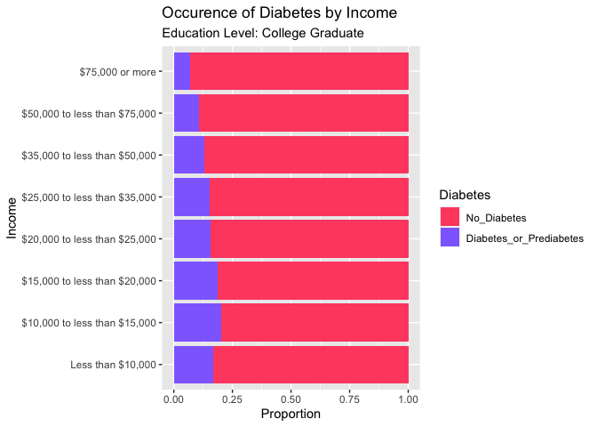
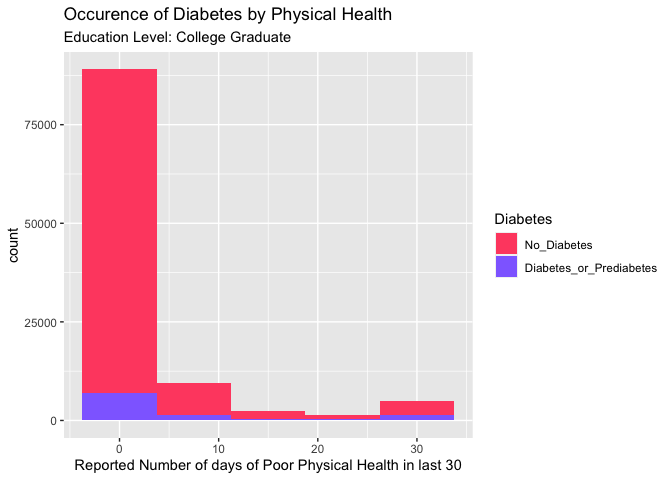
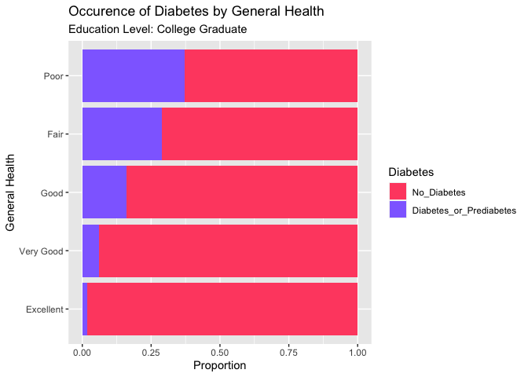

analysis
================

- [Introduction](#introduction)
- [Read in Data](#read-in-data)
- [EDA](#eda)
- [Modeling](#modeling)
  - [Log Loss](#log-loss)
  - [Logistic Regression](#logistic-regression)
  - [LASSO Logistic Regression](#lasso-logistic-regression)
  - [Classification Tree](#classification-tree)
  - [Random Forest](#random-forest)
  - [K-Nearest Neighbors](#k-nearest-neighbors)
  - [Linear Discriminant Analysis](#linear-discriminant-analysis)
  - [Conditional Inference Tree](#conditional-inference-tree)
- [Final Model Selection](#final-model-selection)

# Introduction

We are provided data from the Behavioral Risk Factor Surveillance System
(BRFSS) from 2015. While the original data contains 330 columns, only
columns relevant to diabetes research (22 columns) have been pulled.
This includes data on:

- Presence of High Blood Pressure
- Presence of High Cholesterol, and whether it has been checked in the
  last 5 years
- Body Mass Index
- Whether the subject is a smoker
- If the subject has had a stroke or has history of heart disease
- Whether the subject is physically active
- If the subjects’ diet consists of regular fruits and vegetables
- Whether the subject is a heavy drinker
- Variables concerning health care coverage and access to doctors
- Variables concerning general physical and mental health
- General Data, such as Sex, Age, Education level and Income

Our task is to perform separate analyses for each level of `Education`
in the data set. This document contains analysis for the College
Graduate group.

Prior to fitting models to predict the presence of diabetes, the data
must be read in, processed, and exploratory data analysis (EDA) should
be performed.

Processing involves resolving missing data and recoding certain
variables into more easily used forms. EDA involves summarizing and
visualizing data in order to identify trends and associations.

The end goal is to partition the data into training and testing
datasets, and examine various methods of building classification models
to determine which results in a model with highest efficacy.

# Read in Data

We first read in the data and convert many of the variables to factors.
We then add meaningful level names to each categorical predictor.

``` r
diabetes <- read_csv("diabetes_binary_health_indicators_BRFSS2015.csv") |>
  mutate_at(vars(-BMI, -MentHlth, -PhysHlth), factor) |>
  mutate(Diabetes = fct_recode(Diabetes_binary,"No_Diabetes" = "0", "Diabetes_or_Prediabetes" = "1"), .keep = "unused") |>
  mutate(HighBP = fct_recode(HighBP, "No High BP" = "0", "High BP" = "1")) |>
  mutate(HighChol = fct_recode(HighChol, "No High Chol" = "0", "High Chol" = "1")) |>
  mutate(CholCheck = fct_recode(CholCheck, "No Chol Check" = "0", "Chol Check" = "1")) |>
  mutate(Smoker = fct_recode(Smoker, "No" = "0", "Yes" = "1")) |>
  mutate(Stroke = fct_recode(Stroke, "No" = "0", "Yes" = "1")) |>
  mutate(HeartDiseaseorAttack = fct_recode(HeartDiseaseorAttack, "No" = "0", "Yes" = "1")) |>
  mutate(PhysActivity = fct_recode(PhysActivity, "No" = "0", "Yes" = "1")) |>
  mutate(Fruits = fct_recode(Fruits, "No" = "0", "Yes" = "1")) |>
  mutate(Veggies = fct_recode(Veggies, "No" = "0", "Yes" = "1")) |>
  mutate(HvyAlcoholConsump = fct_recode(HvyAlcoholConsump, "No" = "0", "Yes" = "1")) |>
  mutate(AnyHealthcare = fct_recode(AnyHealthcare, "No" = "0", "Yes" = "1")) |>
  mutate(NoDocbcCost = fct_recode(NoDocbcCost, "No" = "0", "Yes" = "1")) |>
  mutate(GenHlth = fct_recode(GenHlth, "Excellent" = "1", "Very Good" = "2", "Good" = "3", "Fair" = "4", "Poor" = "5")) |>
  mutate(DiffWalk = fct_recode(DiffWalk, "No" = "0", "Yes" = "1")) |>
  mutate(Sex = fct_recode(Sex, "Female" = "0", "Male" = "1")) |>
  mutate(Age = fct_recode(Age,
                          "18 to 24" = "1",
                          "25 to 29" = "2",
                          "30 to 34" = "3",
                          "35 to 39" = "4",
                          "40 to 45" = "5",
                          "45 to 49" = "6",
                          "50 to 54" = "7",
                          "55 to 59" = "8",
                          "60 to 64" = "9",
                          "65 to 69" = "10",
                          "70 to 74" = "11",
                          "75 to 79" = "12",
                          "80 or Older" = "13")) |>
  mutate(Education = fct_recode(Education, 
                                "No School or Elementary" = "1",
                                "No School or Elementary" = "2",
                                "Some High School" = "3",
                                "High School Graduate" = "4",
                                "Some College or Technical School" = "5",
                                "College Graduate" = "6")) |>
  mutate(Income = fct_recode(Income,
                          "Less than $10,000" = "1",
                          "$10,000 to less than $15,000" = "2",
                          "$15,000 to less than $20,000" = "3",
                          "$20,000 to less than $25,000" = "4",
                          "$25,000 to less than $35,000" = "5",
                          "$35,000 to less than $50,000" = "6",
                          "$50,000 to less than $75,000" = "7",
                          "$75,000 or more" = "8")) |>
  select(Diabetes, everything())
```

Next, we filter the data for the education level: College Graduate.
Here’s the final data frame.

``` r
edu_data <- filter(diabetes, Education == params$edu_level)
edu_data
```

    ## # A tibble: 107,325 × 22
    ##    Diabetes    HighBP HighChol CholCheck   BMI Smoker Stroke HeartDiseaseorAttack PhysActivity
    ##    <fct>       <fct>  <fct>    <fct>     <dbl> <fct>  <fct>  <fct>                <fct>       
    ##  1 No_Diabetes No Hi… No High… No Chol …    25 Yes    No     No                   Yes         
    ##  2 No_Diabetes High … High Ch… Chol Che…    25 Yes    No     No                   Yes         
    ##  3 No_Diabetes High … No High… Chol Che…    30 Yes    No     No                   No          
    ##  4 Diabetes_o… No Hi… No High… Chol Che…    25 Yes    No     No                   Yes         
    ##  5 No_Diabetes No Hi… High Ch… Chol Che…    33 Yes    Yes    No                   Yes         
    ##  6 No_Diabetes High … No High… Chol Che…    33 No     No     No                   Yes         
    ##  7 No_Diabetes No Hi… No High… No Chol …    23 No     No     No                   No          
    ##  8 No_Diabetes No Hi… High Ch… Chol Che…    28 No     No     No                   No          
    ##  9 No_Diabetes No Hi… No High… Chol Che…    32 No     No     No                   Yes         
    ## 10 Diabetes_o… High … High Ch… Chol Che…    37 Yes    Yes    Yes                  No          
    ## # ℹ 107,315 more rows
    ## # ℹ 13 more variables: Fruits <fct>, Veggies <fct>, HvyAlcoholConsump <fct>,
    ## #   AnyHealthcare <fct>, NoDocbcCost <fct>, GenHlth <fct>, MentHlth <dbl>, PhysHlth <dbl>,
    ## #   DiffWalk <fct>, Sex <fct>, Age <fct>, Education <fct>, Income <fct>

# EDA

Count of diabetes or prediabetes cases in the College Graduate subgroup.

``` r
ggplot(data = edu_data, aes(x = Diabetes)) +
  geom_bar(fill = c("darkorchid4", "mediumorchid1")) +
  xlab(NULL) +
  labs(title = "Incidence of Diabetes",
       subtitle = paste0("Education Level: ", params$edu_level))
```

<!-- -->

Proportion of individuals with **diabetes or prediabtes** with high
blood pressure and/or high cholesterol:

``` r
edu_data |>
  filter(Diabetes == "Diabetes_or_Prediabetes") |>
  select(HighBP, HighChol) |>
  count(HighBP, HighChol) |>
  arrange(desc(n)) |>
  mutate(prop = round(n/sum(n), 2))
```

    ## # A tibble: 4 × 4
    ##   HighBP     HighChol         n  prop
    ##   <fct>      <fct>        <int> <dbl>
    ## 1 High BP    High Chol     5282  0.51
    ## 2 High BP    No High Chol  2188  0.21
    ## 3 No High BP High Chol     1514  0.15
    ## 4 No High BP No High Chol  1416  0.14

Proportion of individuals with **no diabetes** with high blood pressure
and/or high cholesterol:

``` r
edu_data |>
  filter(Diabetes == "No_Diabetes") |>
  select(HighBP, HighChol) |>
  count(HighBP, HighChol) |>
  arrange(desc(n)) |>
  mutate(prop = round(n/sum(n), 2))
```

    ## # A tibble: 4 × 4
    ##   HighBP     HighChol         n  prop
    ##   <fct>      <fct>        <int> <dbl>
    ## 1 No High BP No High Chol 47537  0.49
    ## 2 No High BP High Chol    18620  0.19
    ## 3 High BP    High Chol    16538  0.17
    ## 4 High BP    No High Chol 14230  0.15

Distribution of BMI:

``` r
ggplot(data = edu_data, aes(x = BMI)) +
  geom_density(aes(fill = Diabetes), alpha = 0.75) +
  scale_fill_manual(values = c("darkorchid4", "mediumorchid1")) +
  labs(title = "BMI Distribution by Occurence of Diabetes",
       subtitle = paste0("Education Level: ", params$edu_level))
```

<!-- -->

Count of individuals who performed physical activity (excluding work) in
the last 30 days:

``` r
ggplot(edu_data, aes(x = PhysActivity)) +
  geom_bar(aes(fill = Diabetes)) +
  scale_fill_manual(values = c("darkorchid4", "mediumorchid1")) +
  labs(title = "Physical Activity by Occurence of Diabetes",
       subtitle = paste0("Education Level: ", params$edu_level)) +
  xlab("physical activity in
past 30 days ")
```

<!-- -->

Occurence of diabetes by age:

``` r
edu_data |>
  filter(Diabetes == "Diabetes_or_Prediabetes") |>
  group_by(Age) |>
  summarise(n = n())
```

    ## # A tibble: 13 × 2
    ##    Age             n
    ##    <fct>       <int>
    ##  1 18 to 24       15
    ##  2 25 to 29       40
    ##  3 30 to 34      103
    ##  4 35 to 39      179
    ##  5 40 to 45      337
    ##  6 45 to 49      486
    ##  7 50 to 54      882
    ##  8 55 to 59     1120
    ##  9 60 to 64     1742
    ## 10 65 to 69     2163
    ## 11 70 to 74     1587
    ## 12 75 to 79      905
    ## 13 80 or Older   841

Occurence of diabetes by income group:

``` r
ggplot(edu_data, aes(y = Income)) + 
  geom_bar(aes(fill = Diabetes), position = "fill") + 
  scale_fill_manual(values = c("#FF5070", "#9070FF")) +
  labs(title = "Occurence of Diabetes by Income", 
       subtitle = paste0("Education Level: ", params$edu_level)) +
  xlab("Proportion")
```

<!-- -->

Count of individuals who eat fruits and/or veggies by occurrence of
diabetes:

``` r
edu_data %>% 
  group_by(Fruits, Veggies, Diabetes) %>% 
  summarise(n = n()) %>% 
  pivot_wider(names_from = Diabetes, values_from = n)
```

    ## # A tibble: 4 × 4
    ## # Groups:   Fruits, Veggies [4]
    ##   Fruits Veggies No_Diabetes Diabetes_or_Prediabetes
    ##   <fct>  <fct>         <int>                   <int>
    ## 1 No     No             6986                    1031
    ## 2 No     Yes           22122                    2729
    ## 3 Yes    No             5082                     763
    ## 4 Yes    Yes           62735                    5877

Distribution of poor mental health days:

``` r
ggplot(data = edu_data, aes(x = MentHlth)) + 
  geom_histogram(bins = 5, aes(fill = Diabetes)) + 
  scale_fill_manual(values = c("#FF5070", "#9070FF")) +
   labs(title = "Occurence of Diabetes by Mental Health", 
       subtitle = paste0("Education Level: ", params$edu_level)) +
  xlab("Reported Number of days of Poor Mental Health in last 30")
```

<!-- -->

Distribution of poor physical health days:

``` r
ggplot(data = edu_data, aes(x = PhysHlth)) + 
  geom_histogram(bins = 5, aes(fill = Diabetes)) + 
  scale_fill_manual(values = c("#FF5070", "#9070FF")) +
   labs(title = "Occurence of Diabetes by Physical Health", 
       subtitle = paste0("Education Level: ", params$edu_level)) +
  xlab("Reported Number of days of Poor Physical Health in last 30")
```

<!-- -->

Proportion of diabetes by general health category:

``` r
ggplot(edu_data, aes(y = GenHlth)) + 
  geom_bar(aes(fill = Diabetes), position = "fill") + 
  scale_fill_manual(values = c("#FF5070", "#9070FF")) +
  labs(title = "Occurence of Diabetes by General Health", 
       subtitle = paste0("Education Level: ", params$edu_level)) +
  xlab("Proportion") + ylab("General Health")
```

<!-- -->

Count of individuals who eat smoke and/or consume more than 14 alcoholic
drinks per week (men) or more than 7 drinks per week (women) by
occurrence of diabetes:

``` r
edu_data %>% 
  group_by(Smoker, HvyAlcoholConsump, Diabetes) %>% 
  summarise(n = n()) %>% 
  pivot_wider(names_from = Diabetes, values_from = n)
```

    ## # A tibble: 4 × 4
    ## # Groups:   Smoker, HvyAlcoholConsump [4]
    ##   Smoker HvyAlcoholConsump No_Diabetes Diabetes_or_Prediabetes
    ##   <fct>  <fct>                   <int>                   <int>
    ## 1 No     No                      61904                    5759
    ## 2 No     Yes                      2764                      88
    ## 3 Yes    No                      28801                    4366
    ## 4 Yes    Yes                      3456                     187

Count of individuals who have health care and/or could not see a doctor
because of cost by diabetes occurrence:

``` r
edu_data %>% 
  group_by(AnyHealthcare, NoDocbcCost, Diabetes) %>% 
  summarise(n = n()) %>% 
  pivot_wider(names_from = Diabetes, values_from = n)
```

    ## # A tibble: 4 × 4
    ## # Groups:   AnyHealthcare, NoDocbcCost [4]
    ##   AnyHealthcare NoDocbcCost No_Diabetes Diabetes_or_Prediabetes
    ##   <fct>         <fct>             <int>                   <int>
    ## 1 No            No                 1640                     128
    ## 2 No            Yes                 736                      90
    ## 3 Yes           No                90234                    9531
    ## 4 Yes           Yes                4315                     651

# Modeling

Before we start modeling the data, we split the data into a training and
test set. We use `createDataPartition` to do so, using 70% of the data
for training while reserving 30% of the data for testing.

``` r
set.seed(10)
index <- createDataPartition(edu_data |> pull(Diabetes), p = 0.7, list = FALSE)
train_data <- edu_data[index, ]
test_data <- edu_data[-index, ]
```

## Log Loss

Log loss, or logarithmic loss, is an evaluation metric for
classification models where the response is binary. It measures
performance of a model, not the accuracy of a model. A lower value of
log loss is indicative of better performance. Log loss is calculated by
the following equation:

$-\frac{1}{N}\sum_i y_i \times log(p(y_i)) + (1-y_i) \times log(1-p(y_i))$

Where $y_i$ is the true outcome and $p(y_i)$ is the predicted
probability of $y_i = 1$

Log loss is the preferred evaluation metric over accuracy for
classification modeling because it is more sensitive to the quality of
predictions, beyond whether the prediction was correct or incorrect.
High probability, incorrect predictions will be more heavily penalized
using a log loss metric. The goal is to develop a model with more
accurate, calibrated predictions.

For all methods of model building, we use the log loss metric to
identify a “best” model.

## Logistic Regression

Logistic regression models are classification models estimating the
probability of a binary event occurring given a set of predictors. The
logistic regression function models an outcome as the log-odds of
success:

$log(\frac{P(success|x)}{1-P(sucess|x)}) = \beta_0 + \beta_1x_1$

Therefore, the $\beta_1$ coefficient should be interpreted as the change
in log-odds given a one-unit change in x. Taking the exponent of both
sides in the above equation, it follows that:

$P(success|x) = \frac{e^{\beta_0 + \beta_1x_1}}{1 + e^{\beta_0 + \beta_1x_1}}$

We use `method = "glm"` and `family = "binomial"` to train three
candidate logistic regression models for predicting diabetes outcome.

``` r
logfit1 <- train(Diabetes ~ Age + HighChol + HighBP + BMI,
                 data = train_data,
                 method = "glm",
                 family = "binomial",
                 trControl = trainControl(method = "cv",
                                         number = 5,
                                         classProbs = TRUE,
                                         summaryFunction=mnLogLoss),
                 metric = "logLoss") 

logfit2 <- train(Diabetes ~ Sex + GenHlth + PhysHlth + MentHlth,
                 data = train_data,
                 method = "glm",
                 family = "binomial",
                 trControl = trainControl(method = "cv",
                                         number = 5,
                                         classProbs = TRUE,
                                         summaryFunction=mnLogLoss),
                 metric = "logLoss")

logfit3 <- train(Diabetes ~ Age + Income + HeartDiseaseorAttack + HvyAlcoholConsump,
                 data = train_data,
                 method = "glm",
                 family = "binomial",
                 trControl = trainControl(method = "cv",
                                         number = 5,
                                         classProbs = TRUE,
                                         summaryFunction=mnLogLoss),
                 metric = "logLoss")
```

The log loss for all three models is summarized in the following table:

``` r
log_results <- tibble("Model" = c("Age + HighChol + HighBP + BMI",
                                  "Sex + GenHlth + PhysHlth + MentHlth",
                                  "Age + Income + HeartDiseaseorAttack + HvyAlcoholConsump"),
                      "logLoss" = c(logfit1$results$logLoss,
                                    logfit2$results$logLoss,
                                    logfit3$results$logLoss))
log_results
```

    ## # A tibble: 3 × 2
    ##   Model                                                   logLoss
    ##   <chr>                                                     <dbl>
    ## 1 Age + HighChol + HighBP + BMI                             0.267
    ## 2 Sex + GenHlth + PhysHlth + MentHlth                       0.278
    ## 3 Age + Income + HeartDiseaseorAttack + HvyAlcoholConsump   0.289

``` r
min <- which.min(log_results$logLoss)

if(min==1){
  logfit <- logfit1
  print("The best model is logfit1")
  }else{
    if(min==2){
      logfit <- logfit2
      print("The best model is logfit2")
    }else{
      logfit <- logfit3
      print("The best model is logfit3")
    }
  }
```

    ## [1] "The best model is logfit1"

## LASSO Logistic Regression

LASSO, or the Least Absolute Shrinkage and Selection Operator, is a
method of maximum likelihood regression that introduces a penalty to the
regression coefficients that is controlled by the parameter
`lambda(`$\lambda$`)`. At $\lambda=0$, there is no penalty, and as the
value of $\lambda$ increases, the penalty increases. This has the effect
of shrinking the regression variables towards 0.

Both LASSO and ridge models employ this penalty, but one of the key
differences between the two regression methods is that LASSO models can
return coefficients of 0. As a result, LASSO is both a means of modeling
as well as variable selection.

The general equation used for LASSO, ridge, and other elastic net
regression models is

$\min\limits_{\beta_0, \beta} \frac{1}{N} w_i l(y_i , \beta_0 + \beta^T x_i ) +\lambda[(1-\alpha)\|\beta\|^2_2 /2+\alpha\|\beta\|_1]$

for the provided values of $\alpha$ and $\lambda$.

Source: <https://glmnet.stanford.edu/articles/glmnet.html>

We use `method = "glmnet"` and `family="binomial"` as well as specifying
tuning parameter `alpha=1` to employ LASSO methods in classification
models. Because of the model’s sensitivity to the scale of the
parameters, the data is centered and standardized prior to model
building.

``` r
lassofit <- train(Diabetes ~ .,
                  data = train_data,
                  method = "glmnet",
                  family = "binomial",
                  preProcess = c("center", "scale"),
                  trControl = trainControl(method = "cv",
                                         number = 5,
                                         classProbs = TRUE,
                                         summaryFunction=mnLogLoss),
                  tuneGrid = expand.grid(alpha=1,
                                          lambda=seq(0, 100, by = 0.1)),
                  metric = "logLoss")
```

Log loss for three best-performing candidate models, as well as tuning
parameters of the models:

``` r
lasso_results <- tibble("Candidate Model" = seq(1, 3),
                        "alpha" = lassofit$results %>% arrange(logLoss) %>% pull(alpha) %>% head(3),
                        "lambda" = lassofit$results %>% arrange(logLoss) %>% pull(lambda) %>% head(3),
                        "logLoss" = lassofit$results %>% arrange(logLoss) %>% pull(logLoss) %>% head(3))
lasso_results
```

    ## # A tibble: 3 × 4
    ##   `Candidate Model` alpha lambda logLoss
    ##               <int> <dbl>  <dbl>   <dbl>
    ## 1                 1     1    0     0.246
    ## 2                 2     1    0.1   0.318
    ## 3                 3     1    0.2   0.318

## Classification Tree

Classification trees are classification models that attempt to predict
the outcome by splitting the data into groups depending on the values of
certain variables. Generally, this process would continue until any
additional splits would add nothing to the model, but the number of
splits can also be controlled using the complexity parameter `cp`.

We use `method = "rpart"` to build classification trees.

``` r
treefit <- train(Diabetes ~ .,
                  data = train_data,
                  method = "rpart",
                  trControl = trainControl(method = "cv",
                                         number = 5,
                                         classProbs = TRUE,
                                         summaryFunction=mnLogLoss),
                  metric = "logLoss")
```

Summary of all candidate models, with tuning parameters and log loss:

``` r
tree_results <- tibble("Candidate Model" = seq(1, nrow(treefit$results)),
                      "cp" = treefit$results$cp,
                      "logLoss" = treefit$results$logLoss)
tree_results
```

    ## # A tibble: 3 × 3
    ##   `Candidate Model`      cp logLoss
    ##               <int>   <dbl>   <dbl>
    ## 1                 1 0.00110   0.280
    ## 2                 2 0.00124   0.280
    ## 3                 3 0.00321   0.302

## Random Forest

Random forests are an extension to ensemble learning methods for
decision tree analysis. Unlike decision trees, however, random forests
only consider a subset of total predictors, $m < p$. Random forest
algorithms follow the same process as bagging, with this key difference.
The steps to building a random forest are:

1.  Draw a bootstrap sample from the training data of sample size = $n$.
2.  Randomly select a subset of predictors = $m$ and train a tree.
3.  Call predictions for OOB observations.
4.  Repeat a large number = $B$ times.
5.  Average predictions (take majority vote) for each observation $i$
    and calculate error.

We use `method = "rf"` to train random forest models for predicting
diabetes outcome, considering values of $m$ from 1 to 5
$(\sqrt{21} = 4.58)$.

``` r
rffit <- train(Diabetes ~ .,
               data = train_data,
               method = "rf",
               trControl = trainControl(method = "cv",
                                        number = 5,
                                        classProbs = TRUE,
                                        summaryFunction=mnLogLoss),
               tuneGrid = data.frame(mtry = 1:5),
               metric = "logLoss")
rffit
```

    ## Random Forest 
    ## 
    ## 75128 samples
    ##    21 predictor
    ##     2 classes: 'No_Diabetes', 'Diabetes_or_Prediabetes' 
    ## 
    ## No pre-processing
    ## Resampling: Cross-Validated (5 fold) 
    ## Summary of sample sizes: 60102, 60102, 60103, 60102, 60103 
    ## Resampling results across tuning parameters:
    ## 
    ##   mtry  logLoss  
    ##   1     2.1049174
    ##   2     1.0306423
    ##   3     0.6379371
    ##   4     0.4788819
    ##   5     0.4065769
    ## 
    ## logLoss was used to select the optimal model using the smallest value.
    ## The final value used for the model was mtry = 5.

## K-Nearest Neighbors

K-Nearest Neighbors (KNN) is a classification model that considers the
value of the surrounding points to predict the value of a target point.
New entries are classified by looking at the value of the closest
entries, and assigning the prevailing classification. The number of
closest entries referenced is determined by the `k` parameter. Various
formulas for distance can be used, depending on the type of data, but
generally Euclidean distance is used for numeric data, and Hamming
distance for categorical data.

We use `method = "knn"` to train k-nearest neighbors models.

``` r
knnfit <- train(Diabetes ~ .,
                  data = train_data,
                  method = "knn",
                  trControl = trainControl(method = "cv",
                                         number = 5,
                                         classProbs = TRUE,
                                         summaryFunction=mnLogLoss),
                  metric = "logLoss")
```

Candidate models are proposed, with their respective tuning parameters
and log Loss.

``` r
knn_results <- tibble("Candidate Model" = seq(1, nrow(knnfit$results)),
                      "k" = knnfit$results$k,
                      "logLoss" = knnfit$results$logLoss)
knn_results
```

    ## # A tibble: 3 × 3
    ##   `Candidate Model`     k logLoss
    ##               <int> <int>   <dbl>
    ## 1                 1     5   0.959
    ## 2                 2     7   0.767
    ## 3                 3     9   0.640

## Linear Discriminant Analysis

Linear Discriminant Analysis (LDA) aims to build a linear combination of
predictors that partitions the data into separate classes, effectively
dividing the data range into sections where all testing points within
the same range would have the same classification.

`method = lda` is used to train LDA models.

``` r
ldafit <- train(Diabetes ~ .,
                  data = train_data[,-21],
                  method = "lda",
                  trControl = trainControl(method = "cv",
                                         number = 5,
                                         classProbs = TRUE,
                                         summaryFunction=mnLogLoss),
                  metric = "logLoss")
ldafit
```

    ## Linear Discriminant Analysis 
    ## 
    ## 75128 samples
    ##    20 predictor
    ##     2 classes: 'No_Diabetes', 'Diabetes_or_Prediabetes' 
    ## 
    ## No pre-processing
    ## Resampling: Cross-Validated (5 fold) 
    ## Summary of sample sizes: 60102, 60102, 60103, 60103, 60102 
    ## Resampling results:
    ## 
    ##   logLoss  
    ##   0.2592053

## Conditional Inference Tree

Conditional inference trees are very similar in design to traditional
decision trees built using `rpart` – they recursive partitioning of the
data to estimate a relationship between predictors and a response.
Unlike decision trees, conditional inference trees use significance
tests and p-values to determine splits in the data. The conditional
inference tree algorithm follows these general steps:

1.  Test for independence between any of the input variables and the
    response. Stop if the null hypothesis ($H_0$: variable and response
    are independent) cannot be rejected for any variable. Otherwise,
    choose the variable with strongest correlation to the response.

2.  Implement a binary split on the selected variable.

3.  Recursively repeat steps one and two.

The developers of the algorithm aimed to correct for the traditional
decision tree’s tendency of selection bias towards variables with many
possible splits and overfitting. No predictor is included and no split
is implemented unless the test exceeds the value given by
`mincriterion`, $1 -$ p-value$(\alpha)$.

To train the conditional inference tree, we use the `ctree` method and
specify values of `mincriterion` = 0.90, 0.95, 0.99 ($\alpha$ = 0.1,
0.05, 0.01).

``` r
ctreefit <- train(Diabetes ~ .,
                  data = train_data,
                  method = "ctree",
                  trControl = trainControl(method = "cv",
                                           number = 5,
                                           classProbs = TRUE,
                                           summaryFunction=mnLogLoss),
                  tuneGrid = data.frame(mincriterion = c(0.9, 0.95, 0.99)),
                  metric = "logLoss")
ctreefit
```

    ## Conditional Inference Tree 
    ## 
    ## 75128 samples
    ##    21 predictor
    ##     2 classes: 'No_Diabetes', 'Diabetes_or_Prediabetes' 
    ## 
    ## No pre-processing
    ## Resampling: Cross-Validated (5 fold) 
    ## Summary of sample sizes: 60103, 60102, 60102, 60102, 60103 
    ## Resampling results across tuning parameters:
    ## 
    ##   mincriterion  logLoss  
    ##   0.90          0.2561742
    ##   0.95          0.2551946
    ##   0.99          0.2557389
    ## 
    ## logLoss was used to select the optimal model using the smallest value.
    ## The final value used for the model was mincriterion = 0.95.

# Final Model Selection

To determine the final model, we take the best six models from each
model fit type above and use these to predict diabetes outcomes on the
`test-data` set. The final model declared the winner is the one that
minimizes log loss.

``` r
logpreds <- predict(logfit, newdata = test_data)
logprobs <- predict(logfit, newdata = test_data, type="prob")

lassopreds <- predict(lassofit, newdata = test_data)
lassoprobs <- predict(lassofit, newdata = test_data, type = "prob")

treepreds <- predict(treefit, newdata = test_data)
treeprobs <- predict(treefit, newdata = test_data, type = "prob")

rfpreds <- predict(rffit, newdata = test_data)
rfprobs <- predict(rffit, newdata = test_data, type = "prob")

knnpreds <- predict(knnfit, newdata = test_data)
knnprobs <- predict(knnfit, newdata = test_data, type = "prob")

ldapreds <- predict(ldafit, newdata = test_data)
ldaprobs <- predict(ldafit, newdata = test_data, type = "prob")

ctreepreds <- predict(ctreefit, newdata = test_data)
ctreeprobs <- predict(ctreefit, newdata = test_data, type = "prob")

obs <- test_data |>
  mutate(Diabetes = fct_recode(Diabetes, 
                               "0" = "No_Diabetes",
                               "1" = "Diabetes_or_Prediabetes")) |>
  select(Diabetes)

test_results <-
tibble("Model Type" = c("Logistic Regression",
                        "LASSO Regression",
                        "Classificaton Tree",
                        "Random Forest",
                        "K-Nearest Neighbors",
                        "Linear Discriminant Analysis",
                        "Conditional Inference Tree"),
       "Accuracy" = c(postResample(logpreds, test_data$Diabetes)[1],
                      postResample(lassopreds, test_data$Diabetes)[1],
                      postResample(treepreds, test_data$Diabetes)[1],
                      postResample(rfpreds, test_data$Diabetes)[1],
                      postResample(knnpreds, test_data$Diabetes)[1],
                      postResample(ldapreds, test_data$Diabetes)[1],
                      postResample(ctreepreds, test_data$Diabetes)[1]),
       "logLoss" = c(logLoss(y = as.numeric(as.character(obs$Diabetes)),
                             p = logprobs[,2])[1],
                     logLoss(y = as.numeric(as.character(obs$Diabetes)),
                             p = lassoprobs[,2])[1],
                     logLoss(y = as.numeric(as.character(obs$Diabetes)),
                             p = treeprobs[,2])[1],
                     logLoss(y = as.numeric(as.character(obs$Diabetes)),
                             p = rfprobs[,2])[1],
                     logLoss(y = as.numeric(as.character(obs$Diabetes)),
                             p = knnprobs[,2])[1],
                     logLoss(y = as.numeric(as.character(obs$Diabetes)),
                             p = ldaprobs[,2])[1],
                     logLoss(y = as.numeric(as.character(obs$Diabetes)),
                             p = ctreeprobs[,2])[1]))
test_results
```

    ## # A tibble: 7 × 3
    ##   `Model Type`                 Accuracy logLoss
    ##   <chr>                           <dbl>   <dbl>
    ## 1 Logistic Regression             0.902   0.266
    ## 2 LASSO Regression                0.905   0.246
    ## 3 Classificaton Tree              0.904   0.279
    ## 4 Random Forest                   0.905   0.434
    ## 5 K-Nearest Neighbors             0.901   0.653
    ## 6 Linear Discriminant Analysis    0.898   0.260
    ## 7 Conditional Inference Tree      0.904   0.260

``` r
best <- which.min(test_results$logLoss)
paste("The winner is",
if(best == 1) {
  "Logistic Regression!"
} else if(best == 2) {
  "LASSO Regression!"
} else if(best == 3) {
  "Classification Tree!"
} else if(best == 4) {
  "Random Forest!"
} else if(best == 5) {
  "K-Nearest Neighbors!"
} else if(best == 6) {
  "Linear Discriminant Analysis!"
} else if(best == 7) {
   "Conditional Inference Tree!"
} else {
  "Error!"
}
)
```

    ## [1] "The winner is LASSO Regression!"
