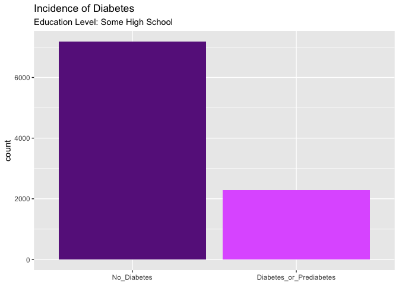
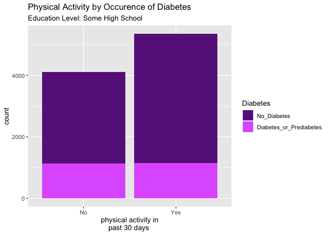
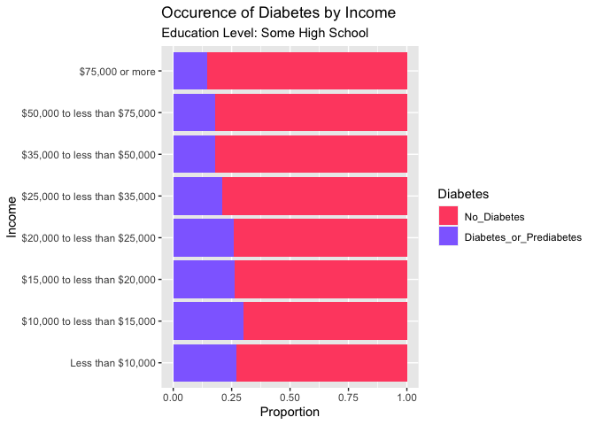
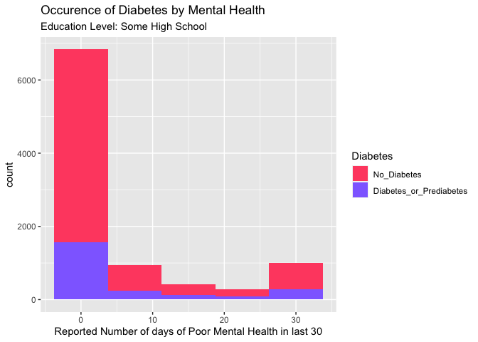

Predicting Diabetes Outcomes
================

- [Introduction](#introduction)
- [Read in Data](#read-in-data)
- [EDA](#eda)
- [Modeling](#modeling)
  - [Log Loss](#log-loss)
  - [Logistic Regression](#logistic-regression)
  - [LASSO Logistic Regression](#lasso-logistic-regression)
  - [Classification Tree](#classification-tree)
  - [Random Forest](#random-forest)
  - [Linear Discriminant Analysis](#linear-discriminant-analysis)
  - [Conditional Inference Tree](#conditional-inference-tree)
- [Final Model Selection](#final-model-selection)

# Introduction

We are provided data from the Behavioral Risk Factor Surveillance System
(BRFSS) from 2015. While the original data contains 330 columns, only
columns relevant to diabetes research (22 columns) have been pulled.
This includes data on:

- Presence of High Blood Pressure
- Presence of High Cholesterol, and whether it has been checked in the
  last 5 years
- Body Mass Index
- Whether the subject is a smoker
- If the subject has had a stroke or has history of heart disease
- Whether the subject is physically active
- If the subjects’ diet consists of regular fruits and vegetables
- Whether the subject is a heavy drinker
- Variables concerning health care coverage and access to doctors
- Variables concerning general physical and mental health
- General Data, such as Sex, Age, Education level and Income

Our task is to perform separate analyses for each level of `Education`
in the data set. This document contains analysis for the Some High
School group.

Prior to fitting models to predict the presence of diabetes, the data
must be read in, processed, and exploratory data analysis (EDA) should
be performed.

Processing involves resolving missing data and recoding certain
variables into more easily used forms. EDA involves summarizing and
visualizing data in order to identify trends and associations.

The end goal is to partition the data into training and testing
datasets, and examine various methods of building classification models
to determine which results in a model with highest efficacy.

# Read in Data

We first read in the data and convert many of the variables to factors.
We then add meaningful level names to each categorical predictor.

``` r
diabetes <- read_csv("diabetes_binary_health_indicators_BRFSS2015.csv") |>
  mutate_at(vars(-BMI, -MentHlth, -PhysHlth), factor) |>
  mutate(Diabetes = fct_recode(Diabetes_binary,
                               "No_Diabetes" = "0",
                               "Diabetes_or_Prediabetes" = "1"),
         .keep = "unused") |>
  mutate(HighBP = fct_recode(HighBP, "No High BP" = "0",
                             "High BP" = "1")) |>
  mutate(HighChol = fct_recode(HighChol, "No High Chol" = "0",
                               "High Chol" = "1")) |>
  mutate(CholCheck = fct_recode(CholCheck, "No Chol Check" = "0",
                                "Chol Check" = "1")) |>
  mutate(Smoker = fct_recode(Smoker, "No" = "0", "Yes" = "1")) |>
  mutate(Stroke = fct_recode(Stroke, "No" = "0", "Yes" = "1")) |>
  mutate(HeartDiseaseorAttack = fct_recode(HeartDiseaseorAttack,
                                           "No" = "0",
                                           "Yes" = "1")) |>
  mutate(PhysActivity = fct_recode(PhysActivity,
                                   "No" = "0",
                                   "Yes" = "1")) |>
  mutate(Fruits = fct_recode(Fruits, "No" = "0", "Yes" = "1")) |>
  mutate(Veggies = fct_recode(Veggies, "No" = "0", "Yes" = "1")) |>
  mutate(HvyAlcoholConsump = fct_recode(HvyAlcoholConsump,
                                        "No" = "0",
                                        "Yes" = "1")) |>
  mutate(AnyHealthcare = fct_recode(AnyHealthcare, "No" = "0", "Yes" = "1")) |>
  mutate(NoDocbcCost = fct_recode(NoDocbcCost, "No" = "0", "Yes" = "1")) |>
  mutate(GenHlth = fct_recode(GenHlth,
                              "Excellent" = "1",
                              "Very Good" = "2",
                              "Good" = "3",
                              "Fair" = "4",
                              "Poor" = "5")) |>
  mutate(DiffWalk = fct_recode(DiffWalk,
                               "No" = "0",
                               "Yes" = "1")) |>
  mutate(Sex = fct_recode(Sex, "Female" = "0", "Male" = "1")) |>
  mutate(Age = fct_recode(Age,
                          "18 to 24" = "1",
                          "25 to 29" = "2",
                          "30 to 34" = "3",
                          "35 to 39" = "4",
                          "40 to 45" = "5",
                          "45 to 49" = "6",
                          "50 to 54" = "7",
                          "55 to 59" = "8",
                          "60 to 64" = "9",
                          "65 to 69" = "10",
                          "70 to 74" = "11",
                          "75 to 79" = "12",
                          "80 or Older" = "13")) |>
  mutate(Education = fct_recode(Education, 
                                "No School or Elementary" = "1",
                                "No School or Elementary" = "2",
                                "Some High School" = "3",
                                "High School Graduate" = "4",
                                "Some College or Technical School" = "5",
                                "College Graduate" = "6")) |>
  mutate(Income = fct_recode(Income,
                          "Less than $10,000" = "1",
                          "$10,000 to less than $15,000" = "2",
                          "$15,000 to less than $20,000" = "3",
                          "$20,000 to less than $25,000" = "4",
                          "$25,000 to less than $35,000" = "5",
                          "$35,000 to less than $50,000" = "6",
                          "$50,000 to less than $75,000" = "7",
                          "$75,000 or more" = "8")) |>
  select(Diabetes, everything())
```

Next, we filter the data for the education level: Some High School.
Here’s the final data frame:

``` r
edu_data <- filter(diabetes, Education == params$edu_level)
edu_data
```

    ## # A tibble: 9,478 × 22
    ##    Diabetes            HighBP HighChol CholCheck   BMI Smoker Stroke HeartDiseaseorAttack
    ##    <fct>               <fct>  <fct>    <fct>     <dbl> <fct>  <fct>  <fct>               
    ##  1 No_Diabetes         High … No High… Chol Che…    27 No     No     No                  
    ##  2 No_Diabetes         High … No High… Chol Che…    33 Yes    No     No                  
    ##  3 Diabetes_or_Predia… High … High Ch… Chol Che…    24 Yes    No     No                  
    ##  4 No_Diabetes         High … High Ch… Chol Che…    24 Yes    No     No                  
    ##  5 No_Diabetes         High … No High… Chol Che…    22 Yes    No     No                  
    ##  6 Diabetes_or_Predia… High … No High… Chol Che…    21 Yes    No     No                  
    ##  7 No_Diabetes         No Hi… No High… No Chol …    24 Yes    No     No                  
    ##  8 No_Diabetes         No Hi… High Ch… Chol Che…    19 Yes    No     No                  
    ##  9 No_Diabetes         No Hi… No High… Chol Che…    23 Yes    No     No                  
    ## 10 No_Diabetes         No Hi… High Ch… Chol Che…    24 Yes    No     No                  
    ## # ℹ 9,468 more rows
    ## # ℹ 14 more variables: PhysActivity <fct>, Fruits <fct>, Veggies <fct>,
    ## #   HvyAlcoholConsump <fct>, AnyHealthcare <fct>, NoDocbcCost <fct>, GenHlth <fct>,
    ## #   MentHlth <dbl>, PhysHlth <dbl>, DiffWalk <fct>, Sex <fct>, Age <fct>,
    ## #   Education <fct>, Income <fct>

# EDA

Count of diabetes or prediabetes cases in the Some High School subgroup.

``` r
ggplot(data = edu_data, aes(x = Diabetes)) +
  geom_bar(fill = c("darkorchid4", "mediumorchid1")) +
  xlab(NULL) +
  labs(title = "Incidence of Diabetes",
       subtitle = paste0("Education Level: ", params$edu_level))
```

<!-- -->

Proportion of individuals with **diabetes or prediabtes** with high
blood pressure and/or high cholesterol:

``` r
edu_data |>
  filter(Diabetes == "Diabetes_or_Prediabetes") |>
  select(HighBP, HighChol) |>
  count(HighBP, HighChol) |>
  arrange(desc(n)) |>
  mutate(prop = round(n/sum(n), 2))
```

    ## # A tibble: 4 × 4
    ##   HighBP     HighChol         n  prop
    ##   <fct>      <fct>        <int> <dbl>
    ## 1 High BP    High Chol     1348  0.59
    ## 2 High BP    No High Chol   501  0.22
    ## 3 No High BP High Chol      234  0.1 
    ## 4 No High BP No High Chol   213  0.09

Proportion of individuals with **no diabetes** with high blood pressure
and/or high cholesterol:

``` r
edu_data |>
  filter(Diabetes == "No_Diabetes") |>
  select(HighBP, HighChol) |>
  count(HighBP, HighChol) |>
  arrange(desc(n)) |>
  mutate(prop = round(n/sum(n), 2))
```

    ## # A tibble: 4 × 4
    ##   HighBP     HighChol         n  prop
    ##   <fct>      <fct>        <int> <dbl>
    ## 1 No High BP No High Chol  2493  0.35
    ## 2 High BP    High Chol     2120  0.3 
    ## 3 High BP    No High Chol  1534  0.21
    ## 4 No High BP High Chol     1035  0.14

Distribution of BMI:

``` r
ggplot(data = edu_data, aes(x = BMI)) +
  geom_density(aes(fill = Diabetes), alpha = 0.75) +
  scale_fill_manual(values = c("darkorchid4", "mediumorchid1")) +
  labs(title = "BMI Distribution by Occurence of Diabetes",
       subtitle = paste0("Education Level: ", params$edu_level))
```

<!-- -->

Count of individuals who performed physical activity (excluding work) in
the last 30 days:

``` r
ggplot(edu_data, aes(x = PhysActivity)) +
  geom_bar(aes(fill = Diabetes)) +
  scale_fill_manual(values = c("darkorchid4", "mediumorchid1")) +
  labs(title = "Physical Activity by Occurence of Diabetes",
       subtitle = paste0("Education Level: ", params$edu_level)) +
  xlab("physical activity in
past 30 days ")
```

<!-- -->

Occurrence of diabetes by age:

``` r
edu_data |>
  filter(Diabetes == "Diabetes_or_Prediabetes") |>
  group_by(Age) |>
  summarise(n = n())
```

    ## # A tibble: 13 × 2
    ##    Age             n
    ##    <fct>       <int>
    ##  1 18 to 24        4
    ##  2 25 to 29       10
    ##  3 30 to 34       23
    ##  4 35 to 39       38
    ##  5 40 to 45       71
    ##  6 45 to 49      115
    ##  7 50 to 54      209
    ##  8 55 to 59      292
    ##  9 60 to 64      321
    ## 10 65 to 69      320
    ## 11 70 to 74      354
    ## 12 75 to 79      273
    ## 13 80 or Older   266

Occurrence of diabetes by income group:

``` r
ggplot(edu_data, aes(y = Income)) + 
  geom_bar(aes(fill = Diabetes), position = "fill") + 
  scale_fill_manual(values = c("#FF5070", "#9070FF")) +
  labs(title = "Occurence of Diabetes by Income", 
       subtitle = paste0("Education Level: ", params$edu_level)) +
  xlab("Proportion")
```

<!-- -->

Count of individuals who eat fruits and/or veggies by occurrence of
diabetes:

``` r
edu_data %>% 
  group_by(Fruits, Veggies, Diabetes) %>% 
  summarise(n = n()) %>% 
  pivot_wider(names_from = Diabetes, values_from = n)
```

    ## # A tibble: 4 × 4
    ## # Groups:   Fruits, Veggies [4]
    ##   Fruits Veggies No_Diabetes Diabetes_or_Prediabetes
    ##   <fct>  <fct>         <int>                   <int>
    ## 1 No     No             1544                     509
    ## 2 No     Yes            1876                     586
    ## 3 Yes    No              731                     284
    ## 4 Yes    Yes            3031                     917

Distribution of poor mental health days:

``` r
ggplot(data = edu_data, aes(x = MentHlth)) + 
  geom_histogram(bins = 5, aes(fill = Diabetes)) + 
  scale_fill_manual(values = c("#FF5070", "#9070FF")) +
   labs(title = "Occurence of Diabetes by Mental Health", 
       subtitle = paste0("Education Level: ", params$edu_level)) +
  xlab("Reported Number of days of Poor Mental Health in last 30")
```

<!-- -->

Distribution of poor physical health days:

``` r
ggplot(data = edu_data, aes(x = PhysHlth)) + 
  geom_histogram(bins = 5, aes(fill = Diabetes)) + 
  scale_fill_manual(values = c("#FF5070", "#9070FF")) +
   labs(title = "Occurence of Diabetes by Physical Health", 
       subtitle = paste0("Education Level: ", params$edu_level)) +
  xlab("Reported Number of days of Poor Physical Health in last 30")
```

<!-- -->

Proportion of diabetes by general health category:

``` r
ggplot(edu_data, aes(y = GenHlth)) + 
  geom_bar(aes(fill = Diabetes), position = "fill") + 
  scale_fill_manual(values = c("#FF5070", "#9070FF")) +
  labs(title = "Occurence of Diabetes by General Health", 
       subtitle = paste0("Education Level: ", params$edu_level)) +
  xlab("Proportion") + ylab("General Health")
```

<!-- -->

Count of individuals who eat smoke and/or consume more than 14 alcoholic
drinks per week (men) or more than 7 drinks per week (women) by
occurrence of diabetes:

``` r
edu_data %>% 
  group_by(Smoker, HvyAlcoholConsump, Diabetes) %>% 
  summarise(n = n()) %>% 
  pivot_wider(names_from = Diabetes, values_from = n)
```

    ## # A tibble: 4 × 4
    ## # Groups:   Smoker, HvyAlcoholConsump [4]
    ##   Smoker HvyAlcoholConsump No_Diabetes Diabetes_or_Prediabetes
    ##   <fct>  <fct>                   <int>                   <int>
    ## 1 No     No                       2671                     853
    ## 2 No     Yes                        53                       5
    ## 3 Yes    No                       4181                    1403
    ## 4 Yes    Yes                       277                      35

Count of individuals who have health care and/or could not see a doctor
because of cost by diabetes occurrence:

``` r
edu_data %>% 
  group_by(AnyHealthcare, NoDocbcCost, Diabetes) %>% 
  summarise(n = n()) %>% 
  pivot_wider(names_from = Diabetes, values_from = n)
```

    ## # A tibble: 4 × 4
    ## # Groups:   AnyHealthcare, NoDocbcCost [4]
    ##   AnyHealthcare NoDocbcCost No_Diabetes Diabetes_or_Prediabetes
    ##   <fct>         <fct>             <int>                   <int>
    ## 1 No            No                  578                      76
    ## 2 No            Yes                 412                      68
    ## 3 Yes           No                 5432                    1849
    ## 4 Yes           Yes                 760                     303

# Modeling

In our analysis, we employ six model types to predict diabetes outcomes.
Prior to modeling, we split the data into a train set and a test set. We
use `createDataPartition` to do so, employing 70% of the data for
training while reserving 30% for testing.

``` r
set.seed(10)
index <- createDataPartition(edu_data |> pull(Diabetes),
                             p = 0.7,
                             list = FALSE)
train_data <- edu_data[index, ]
test_data <- edu_data[-index, ]
```

## Log Loss

Log loss, or logarithmic loss, is an evaluation metric for
classification models where the response is binary. It measures
performance of a model, not the accuracy of a model. A lower value of
log loss is indicative of better performance.

Log loss is the preferred evaluation metric over accuracy for
classification modeling because it is more sensitive to the quality of
predictions, beyond whether the prediction was correct or incorrect.
High probability, incorrect predictions will be more heavily penalized
using a log loss metric. The goal is to develop a model with more
accurate, calibrated predictions.

For all methods of model building, we use the log loss metric to
identify a “best” model.

## Logistic Regression

Logistic regression models are classification models estimating the
probability of a binary event occurring given a set of predictors. The
logistic regression function models an outcome as the log-odds of
success. Therefore, the regression coefficient should be interpreted as
the change in log-odds given a one-unit change in x, holding all other
variables constant.

We use `method = "glm"` and `family = "binomial"` to train three
candidate logistic regression models for predicting diabetes outcome.

``` r
logfit1 <- train(Diabetes ~ Age + HighChol + HighBP + BMI,
                 data = train_data,
                 method = "glm",
                 family = "binomial",
                 trControl = trainControl(method = "cv",
                                         number = 5,
                                         classProbs = TRUE,
                                         summaryFunction=mnLogLoss),
                 metric = "logLoss") 

logfit2 <- train(Diabetes ~ Sex + GenHlth + PhysHlth + MentHlth,
                 data = train_data,
                 method = "glm",
                 family = "binomial",
                 trControl = trainControl(method = "cv",
                                         number = 5,
                                         classProbs = TRUE,
                                         summaryFunction=mnLogLoss),
                 metric = "logLoss")

logfit3 <- train(Diabetes ~ Age + Income + HeartDiseaseorAttack + HvyAlcoholConsump,
                 data = train_data,
                 method = "glm",
                 family = "binomial",
                 trControl = trainControl(method = "cv",
                                         number = 5,
                                         classProbs = TRUE,
                                         summaryFunction=mnLogLoss),
                 metric = "logLoss")
```

The log loss for all three models is summarized in the following table:

``` r
log_results <- tibble("Model" = c("Age + HighChol + HighBP + BMI",
                                  "Sex + GenHlth + PhysHlth + MentHlth",
                                  "Age + Income + HeartDiseaseorAttack + HvyAlcoholConsump"),
                      "logLoss" = c(logfit1$results$logLoss,
                                    logfit2$results$logLoss,
                                    logfit3$results$logLoss))
log_results
```

    ## # A tibble: 3 × 2
    ##   Model                                                   logLoss
    ##   <chr>                                                     <dbl>
    ## 1 Age + HighChol + HighBP + BMI                             0.487
    ## 2 Sex + GenHlth + PhysHlth + MentHlth                       0.527
    ## 3 Age + Income + HeartDiseaseorAttack + HvyAlcoholConsump   0.522

``` r
min <- which.min(log_results$logLoss)

if(min==1){
  logfit <- logfit1
  print("The best model is logfit1")
  }else{
    if(min==2){
      logfit <- logfit2
      print("The best model is logfit2")
    }else{
      logfit <- logfit3
      print("The best model is logfit3")
    }
  }
```

    ## [1] "The best model is logfit1"

## LASSO Logistic Regression

LASSO, or the Least Absolute Shrinkage and Selection Operator, is a
method of maximum likelihood regression that introduces a penalty to the
regression coefficients that is controlled by the parameter `lambda`. At
`lambda = 0`, there is no penalty, and as the value of `lambda`
increases, the penalty increases. This has the effect of shrinking the
regression variables towards 0.

Both LASSO and ridge models employ this penalty, but one of the key
differences between the two regression methods is that LASSO models can
return coefficients of 0. As a result, LASSO is both a means of modeling
as well as variable selection.

Source: <https://glmnet.stanford.edu/articles/glmnet.html>

We use `method = "glmnet"` and `family="binomial"` as well as specifying
tuning parameter `alpha=1` to employ LASSO methods in classification
models. Because of the model’s sensitivity to the scale of the
parameters, the data is centered and standardized prior to model
building.

``` r
lassofit <- train(Diabetes ~ .,
                  data = train_data,
                  method = "glmnet",
                  family = "binomial",
                  preProcess = c("center", "scale"),
                  trControl = trainControl(method = "cv",
                                         number = 5,
                                         classProbs = TRUE,
                                         summaryFunction=mnLogLoss),
                  tuneGrid = expand.grid(alpha=1,
                                          lambda=seq(0, 100, by = 0.1)),
                  metric = "logLoss")
```

Log loss for three best-performing candidate models, as well as tuning
parameters of the models:

``` r
lasso_results <- tibble("Candidate Model" = seq(1, 3),
                        "alpha" = lassofit$results %>% arrange(logLoss) %>% pull(alpha) %>% head(3),
                        "lambda" = lassofit$results %>% arrange(logLoss) %>% pull(lambda) %>% head(3),
                        "logLoss" = lassofit$results %>% arrange(logLoss) %>% pull(logLoss) %>% head(3))
lasso_results
```

    ## # A tibble: 3 × 4
    ##   `Candidate Model` alpha lambda logLoss
    ##               <int> <dbl>  <dbl>   <dbl>
    ## 1                 1     1    0     0.474
    ## 2                 2     1    0.1   0.548
    ## 3                 3     1    0.2   0.554

## Classification Tree

Classification trees are classification models that attempt to predict
the outcome by splitting the data into groups depending on the values of
certain variables. Generally, this process would continue until any
additional splits would add nothing to the model, but the number of
splits can also be controlled using the complexity parameter `cp`.

We use `method = "rpart"` to build classification trees.

``` r
treefit <- train(Diabetes ~ .,
                  data = train_data,
                  method = "rpart",
                  trControl = trainControl(method = "cv",
                                         number = 5,
                                         classProbs = TRUE,
                                         summaryFunction=mnLogLoss),
                  metric = "logLoss")
```

Summary of all candidate models, with tuning parameters and log loss:

``` r
tree_results <- tibble("Candidate Model" = seq(1, nrow(treefit$results)),
                      "cp" = treefit$results$cp,
                      "logLoss" = treefit$results$logLoss)
tree_results
```

    ## # A tibble: 3 × 3
    ##   `Candidate Model`      cp logLoss
    ##               <int>   <dbl>   <dbl>
    ## 1                 1 0.00560   0.504
    ## 2                 2 0.0112    0.503
    ## 3                 3 0.0174    0.522

## Random Forest

Random forests are an extension to ensemble learning methods for
decision tree analysis. Unlike decision trees, however, random forests
only consider a subset of total predictors, m \< p. Random forest
algorithms follow the same process as bagging, with this key difference.
The steps to building a random forest are:

1.  Draw a bootstrap sample from the training data of sample size = n.
2.  Randomly select a subset of predictors = m and train a tree.
3.  Call predictions for OOB observations.
4.  Repeat a large number = B times.
5.  Average predictions (take majority vote) for each observation i and
    calculate error.

We use `method = "rf"` to train random forest models for predicting
diabetes outcome, considering values of m from 1 to 5.

``` r
rffit <- train(Diabetes ~ .,
               data = train_data,
               method = "rf",
               trControl = trainControl(method = "cv",
                                        number = 5,
                                        classProbs = TRUE,
                                        summaryFunction=mnLogLoss),
               tuneGrid = data.frame(mtry = 1:5),
               metric = "logLoss")
rffit
```

    ## Random Forest 
    ## 
    ## 6636 samples
    ##   21 predictor
    ##    2 classes: 'No_Diabetes', 'Diabetes_or_Prediabetes' 
    ## 
    ## No pre-processing
    ## Resampling: Cross-Validated (5 fold) 
    ## Summary of sample sizes: 5308, 5310, 5310, 5308, 5308 
    ## Resampling results across tuning parameters:
    ## 
    ##   mtry  logLoss  
    ##   1     1.3721762
    ##   2     0.6287822
    ##   3     0.5104931
    ##   4     0.4905814
    ##   5     0.4813447
    ## 
    ## logLoss was used to select the optimal model using the smallest value.
    ## The final value used for the model was mtry = 5.

## Linear Discriminant Analysis

Linear Discriminant Analysis (LDA) aims to build a linear combination of
predictors that partitions the data into separate classes, effectively
dividing the data range into sections where all testing points within
the same range would have the same classification.

`method = lda` is used to train LDA models.

``` r
ldafit <- train(Diabetes ~ .,
                  data = train_data[,-21],
                  method = "lda",
                  trControl = trainControl(method = "cv",
                                         number = 5,
                                         classProbs = TRUE,
                                         summaryFunction=mnLogLoss),
                  metric = "logLoss")
ldafit
```

    ## Linear Discriminant Analysis 
    ## 
    ## 6636 samples
    ##   20 predictor
    ##    2 classes: 'No_Diabetes', 'Diabetes_or_Prediabetes' 
    ## 
    ## No pre-processing
    ## Resampling: Cross-Validated (5 fold) 
    ## Summary of sample sizes: 5309, 5310, 5308, 5309, 5308 
    ## Resampling results:
    ## 
    ##   logLoss  
    ##   0.4752353

## Conditional Inference Tree

Conditional inference trees are very similar in design to traditional
decision trees built using `rpart` – they recursive partitioning of the
data to estimate a relationship between predictors and a response.
Unlike decision trees, conditional inference trees use significance
tests and p-values to determine splits in the data. The conditional
inference tree algorithm follows these general steps:

1.  Test for independence between any of the input variables and the
    response. Stop if the null hypothesis (H0: variable and response are
    independent) cannot be rejected for any variable. Otherwise, choose
    the variable with strongest correlation to the response.

2.  Implement a binary split on the selected variable.

3.  Recursively repeat steps one and two.

The developers of the algorithm aimed to correct for the traditional
decision tree’s tendency of selection bias towards variables with many
possible splits and overfitting. No predictor is included and no split
is implemented unless the test exceeds the value given by
`mincriterion = 1 - p-value`.

To train the conditional inference tree, we use the `ctree` method and
specify values of `mincriterion` = 0.90, 0.95, 0.99 (p-value = 0.1,
0.05, 0.01).

``` r
ctreefit <- train(Diabetes ~ .,
                  data = train_data,
                  method = "ctree",
                  trControl = trainControl(method = "cv",
                                           number = 5,
                                           classProbs = TRUE,
                                           summaryFunction=mnLogLoss),
                  tuneGrid = data.frame(mincriterion = c(0.9, 0.95, 0.99)),
                  metric = "logLoss")
ctreefit
```

    ## Conditional Inference Tree 
    ## 
    ## 6636 samples
    ##   21 predictor
    ##    2 classes: 'No_Diabetes', 'Diabetes_or_Prediabetes' 
    ## 
    ## No pre-processing
    ## Resampling: Cross-Validated (5 fold) 
    ## Summary of sample sizes: 5308, 5309, 5310, 5309, 5308 
    ## Resampling results across tuning parameters:
    ## 
    ##   mincriterion  logLoss  
    ##   0.90          0.5009964
    ##   0.95          0.4954739
    ##   0.99          0.4966612
    ## 
    ## logLoss was used to select the optimal model using the smallest value.
    ## The final value used for the model was mincriterion = 0.95.

# Final Model Selection

To determine the final model, we take the best six models from each
model fit type above and use these to predict diabetes outcomes on the
`test_data` set. The final model declared the winner is the one that
minimizes log loss.

``` r
logpreds <- predict(logfit, newdata = test_data)
logprobs <- predict(logfit, newdata = test_data, type="prob")

lassopreds <- predict(lassofit, newdata = test_data)
lassoprobs <- predict(lassofit, newdata = test_data, type = "prob")

treepreds <- predict(treefit, newdata = test_data)
treeprobs <- predict(treefit, newdata = test_data, type = "prob")

rfpreds <- predict(rffit, newdata = test_data)
rfprobs <- predict(rffit, newdata = test_data, type = "prob")

ldapreds <- predict(ldafit, newdata = test_data)
ldaprobs <- predict(ldafit, newdata = test_data, type = "prob")

ctreepreds <- predict(ctreefit, newdata = test_data)
ctreeprobs <- predict(ctreefit, newdata = test_data, type = "prob")

obs <- test_data |>
  mutate(Diabetes = fct_recode(Diabetes, 
                               "0" = "No_Diabetes",
                               "1" = "Diabetes_or_Prediabetes")) |>
  select(Diabetes)

test_results <-
tibble("Model Type" = c("Logistic Regression",
                        "LASSO Regression",
                        "Classificaton Tree",
                        "Random Forest",
                        "Linear Discriminant Analysis",
                        "Conditional Inference Tree"),
       "Accuracy" = c(postResample(logpreds, test_data$Diabetes)[1],
                      postResample(lassopreds, test_data$Diabetes)[1],
                      postResample(treepreds, test_data$Diabetes)[1],
                      postResample(rfpreds, test_data$Diabetes)[1],
                      postResample(ldapreds, test_data$Diabetes)[1],
                      postResample(ctreepreds, test_data$Diabetes)[1]),
       "logLoss" = c(logLoss(y = as.numeric(as.character(obs$Diabetes)),
                             p = logprobs[,2])[1],
                     logLoss(y = as.numeric(as.character(obs$Diabetes)),
                             p = lassoprobs[,2])[1],
                     logLoss(y = as.numeric(as.character(obs$Diabetes)),
                             p = treeprobs[,2])[1],
                     logLoss(y = as.numeric(as.character(obs$Diabetes)),
                             p = rfprobs[,2])[1],
                     logLoss(y = as.numeric(as.character(obs$Diabetes)),
                             p = ldaprobs[,2])[1],
                     logLoss(y = as.numeric(as.character(obs$Diabetes)),
                             p = ctreeprobs[,2])[1]))
```

Accuracy and log loss metrics for all six models:

``` r
test_results
```

    ## # A tibble: 6 × 3
    ##   `Model Type`                 Accuracy logLoss
    ##   <chr>                           <dbl>   <dbl>
    ## 1 Logistic Regression             0.766   0.480
    ## 2 LASSO Regression                0.772   0.468
    ## 3 Classificaton Tree              0.765   0.506
    ## 4 Random Forest                   0.771   0.476
    ## 5 Linear Discriminant Analysis    0.771   0.471
    ## 6 Conditional Inference Tree      0.764   0.488

``` r
best <- which.min(test_results$logLoss)
paste("The winner is",
if(best == 1) {
  "Logistic Regression!"
} else if(best == 2) {
  "LASSO Regression!"
} else if(best == 3) {
  "Classification Tree!"
} else if(best == 4) {
  "Random Forest!"
} else if(best == 5) {
  "Linear Discriminant Analysis!"
} else if(best == 6) {
  "Conditional Inference Tree!"
})
```

    ## [1] "The winner is LASSO Regression!"
