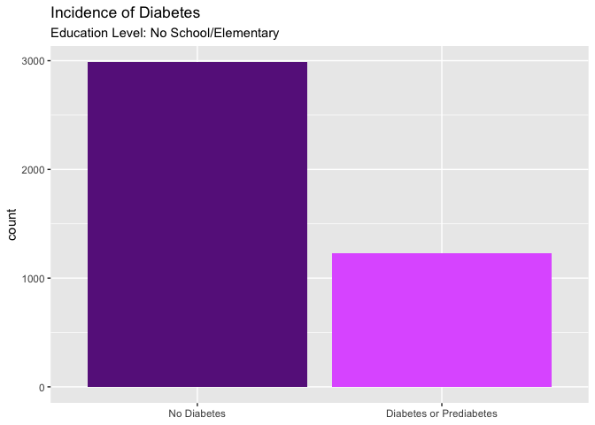
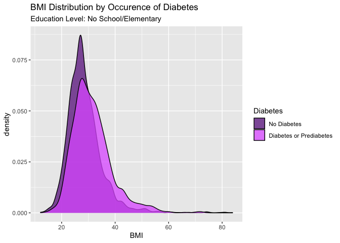
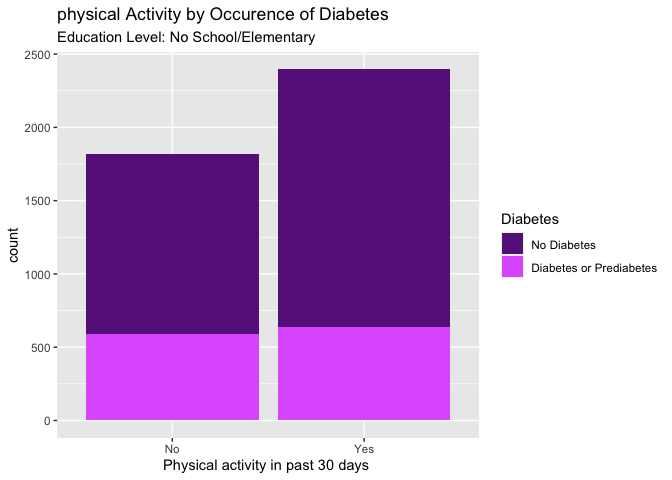

analysis
================

# Read in Data

``` r
diabetes <- read_csv("diabetes_binary_health_indicators_BRFSS2015.csv") |>
  mutate_at(vars(-BMI, -MentHlth, -PhysHlth), factor) |>
  mutate(Diabetes = fct_recode(Diabetes_binary, "No Diabetes" = "0", "Diabetes or Prediabetes" = "1"), .keep = "unused") |>
  mutate(HighBP = fct_recode(HighBP, "No High BP" = "0", "High BP" = "1")) |>
  mutate(HighChol = fct_recode(HighChol, "No High Chol" = "0", "High Chol" = "1")) |>
  mutate(CholCheck = fct_recode(CholCheck, "No Chol Check" = "0", "Chol Check" = "1")) |>
  mutate(Smoker = fct_recode(Smoker, "No" = "0", "Yes" = "1")) |>
  mutate(Stroke = fct_recode(Stroke, "No" = "0", "Yes" = "1")) |>
  mutate(HeartDiseaseorAttack = fct_recode(HeartDiseaseorAttack, "No" = "0", "Yes" = "1")) |>
  mutate(PhysActivity = fct_recode(PhysActivity, "No" = "0", "Yes" = "1")) |>
  mutate(Fruits = fct_recode(Fruits, "No" = "0", "Yes" = "1")) |>
  mutate(Veggies = fct_recode(Veggies, "No" = "0", "Yes" = "1")) |>
  mutate(HvyAlcoholConsump = fct_recode(HvyAlcoholConsump, "No" = "0", "Yes" = "1")) |>
  mutate(AnyHealthcare = fct_recode(AnyHealthcare, "No" = "0", "Yes" = "1")) |>
  mutate(NoDocbcCost = fct_recode(NoDocbcCost, "No" = "0", "Yes" = "1")) |>
  mutate(GenHlth = fct_recode(GenHlth, "Excellent" = "1", "Very Good" = "2", "Good" = "3", "Fair" = "4", "Poor" = "5")) |>
  mutate(DiffWalk = fct_recode(DiffWalk, "No" = "0", "Yes" = "1")) |>
  mutate(Sex = fct_recode(Sex, "Female" = "0", "Male" = "1")) |>
  mutate(Age = fct_recode(Age,
                          "18 to 24" = "1",
                          "25 to 29" = "2",
                          "30 to 34" = "3",
                          "35 to 39" = "4",
                          "40 to 45" = "5",
                          "45 to 49" = "6",
                          "50 to 54" = "7",
                          "55 to 59" = "8",
                          "60 to 64" = "9",
                          "65 to 69" = "10",
                          "70 to 74" = "11",
                          "75 to 79" = "12",
                          "80 or Older" = "13")) |>
  mutate(Education = fct_recode(Education, 
                                "No School/Elementary" = "1",
                                "No School/Elementary" = "2",
                                "Some High School" = "3",
                                "High School Graduate" = "4",
                                "Some College or Technical School" = "5",
                                "College Graduate" = "6")) |>
  mutate(Income = fct_recode(Income,
                          "Less than $10,000" = "1",
                          "$10,000 to less than $15,000" = "2",
                          "$15,000 to less than $20,000" = "3",
                          "$20,000 to less than $25,000" = "4",
                          "$25,000 to less than $35,000" = "5",
                          "$35,000 to less than $50,000" = "6",
                          "$50,000 to less than $75,000" = "7",
                          "$75,000 or more" = "8")) |>
  select(Diabetes, everything())

diabetes
```

    ## # A tibble: 253,680 × 22
    ##    Diabetes   HighBP HighChol CholCheck   BMI Smoker Stroke HeartDiseaseorAttack
    ##    <fct>      <fct>  <fct>    <fct>     <dbl> <fct>  <fct>  <fct>               
    ##  1 No Diabet… High … High Ch… Chol Che…    40 Yes    No     No                  
    ##  2 No Diabet… No Hi… No High… No Chol …    25 Yes    No     No                  
    ##  3 No Diabet… High … High Ch… Chol Che…    28 No     No     No                  
    ##  4 No Diabet… High … No High… Chol Che…    27 No     No     No                  
    ##  5 No Diabet… High … High Ch… Chol Che…    24 No     No     No                  
    ##  6 No Diabet… High … High Ch… Chol Che…    25 Yes    No     No                  
    ##  7 No Diabet… High … No High… Chol Che…    30 Yes    No     No                  
    ##  8 No Diabet… High … High Ch… Chol Che…    25 Yes    No     No                  
    ##  9 Diabetes … High … High Ch… Chol Che…    30 Yes    No     Yes                 
    ## 10 No Diabet… No Hi… No High… Chol Che…    24 No     No     No                  
    ## # ℹ 253,670 more rows
    ## # ℹ 14 more variables: PhysActivity <fct>, Fruits <fct>, Veggies <fct>,
    ## #   HvyAlcoholConsump <fct>, AnyHealthcare <fct>, NoDocbcCost <fct>,
    ## #   GenHlth <fct>, MentHlth <dbl>, PhysHlth <dbl>, DiffWalk <fct>, Sex <fct>,
    ## #   Age <fct>, Education <fct>, Income <fct>

``` r
edu_data <- filter(diabetes, Education == params$edu_level)
```

# EDA

``` r
ggplot(data = edu_data, aes(x = Diabetes)) +
  geom_bar(fill = c("darkorchid4", "mediumorchid1")) +
  xlab(NULL) +
  labs(title = "Incidence of Diabetes",
       subtitle = paste0("Education Level: ", params$edu_level))
```

<!-- -->

``` r
edu_data |>
  filter(Diabetes == "Diabetes or Prediabetes") |>
  select(HighBP, HighChol) |>
  count(HighBP, HighChol) |>
  arrange(desc(n)) |>
  mutate(prop = round(n/sum(n), 2))
```

    ## # A tibble: 4 × 4
    ##   HighBP     HighChol         n  prop
    ##   <fct>      <fct>        <int> <dbl>
    ## 1 High BP    High Chol      735  0.6 
    ## 2 High BP    No High Chol   227  0.18
    ## 3 No High BP High Chol      141  0.11
    ## 4 No High BP No High Chol   127  0.1

``` r
ggplot(data = edu_data, aes(x = BMI)) +
  geom_density(aes(fill = Diabetes), alpha = 0.75) +
  scale_fill_manual(values = c("darkorchid4", "mediumorchid1")) +
  labs(title = "BMI Distribution by Occurence of Diabetes",
       subtitle = paste0("Education Level: ", params$edu_level))
```

<!-- -->

``` r
ggplot(edu_data, aes(x = PhysActivity)) +
  geom_bar(aes(fill = Diabetes)) +
  scale_fill_manual(values = c("darkorchid4", "mediumorchid1")) +
  labs(title = "physical Activity by Occurence of Diabetes",
       subtitle = paste0("Education Level: ", params$edu_level)) +
  xlab("Physical activity in past 30 days ")
```

<!-- -->
